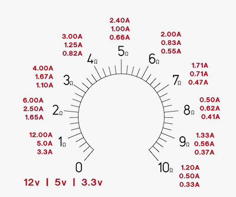

# Rheostat enclosure

I have a 10W 10 Ohm rheostat that looks like this

A bit messy to attach crocodile claps, but surelly it works just fine. One way to improve the appearance and have a satisfaction of a simple project completed is to give it an enclosure.

Some projects are way way too simple to justify spending time designing and 3d printing enclosure for them. This is the one. 

I have PVC sheets that I salvaged from a street sign, cutting them on table saw and gluing parts together with pvc cement like [Red Hot Blue Glue][1] is straightfoward.

This is how the end-result looks like

One notable thing is that round dials can be creared in [frontpanelexpress][2]

---

* [1]: <https://tchristy.com/product/red-hot-blue-glue/> Red Hot Blue Glue 
* [2]: <https://www.frontpanelexpress.com/front-panel-designer#download> Frontpanel Express tool
