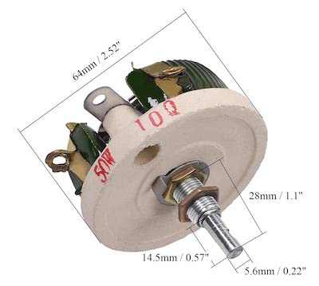
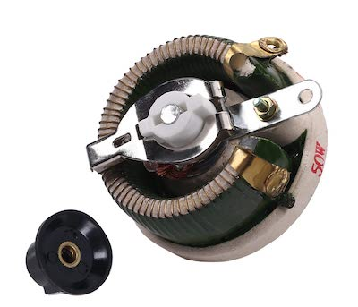
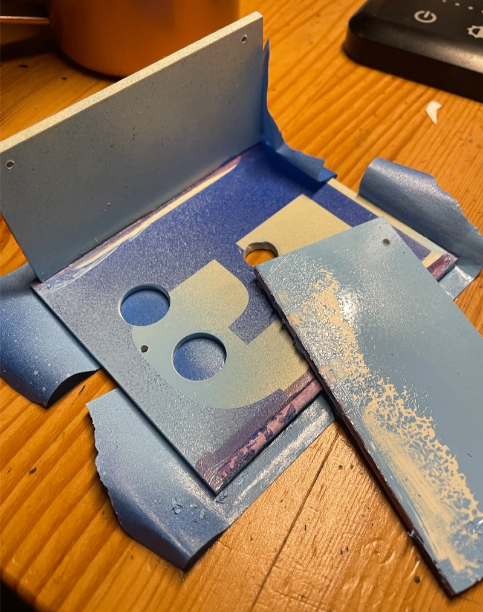
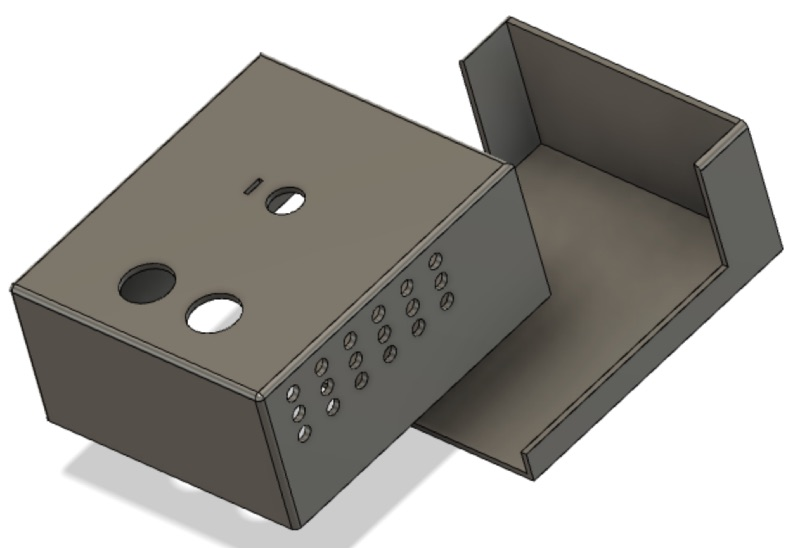
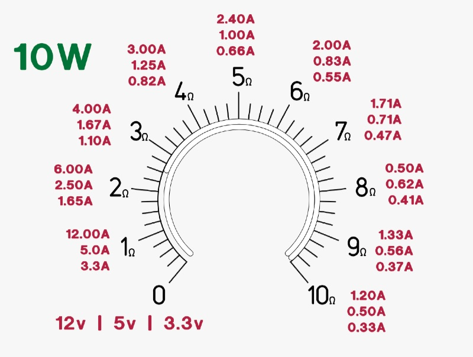
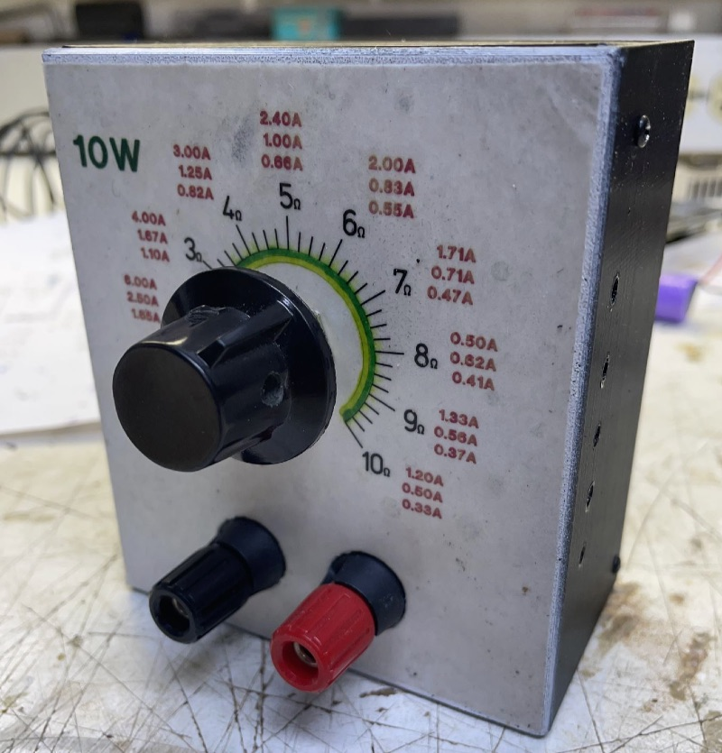

# Rheostat enclosure

I have a 10W 10 Ohm rheostat that looks like this.

A bit messy to attach crocodile claps, but it works fine. One way to improve the appearance and have satisfaction of a simple project completed is to give it an enclosure.

I have PVC sheets that I salvaged from a street sign. Instead of 3d printing, I'd cut them on the table saw and glue parts together with PVC cement like [Red Hot Blue Glue][1].

Unfortunately, it did not hold up. Sidewalls are tall and break apart with gentle force. So I tried again, now making sure to use the purple primer. And the results were the same.

I have another box with much shorter (30mm?) walls, and it turned out ok. Either the heigh-to-width ratio over the glue strength or the low ambient temperature decreased the glue grip.
It is around +5C now in the garage. The glue spec says to use it at 4.5C and 43C.

My attempt to save time only took more time. So I gave up and went with the plan B - 3D printed enclosure. Still, I could not resist trying new things, so I made an L-shaped enclosure with a few self-tapping screws this time. See CAD files.

FrontpaneleEpress2 is an excellent and free tool. I created this round dial there. I exported it to PDF, printed it on paper, glued it to the enclosure, and then sprayed it with Poly. 

The end result

---

* [1]: <https://tchristy.com/product/red-hot-blue-glue/> Red Hot Blue Glue 
* [2]: <https://www.frontpanelexpress.com/front-panel-designer#download> Frontpanel Express tool
